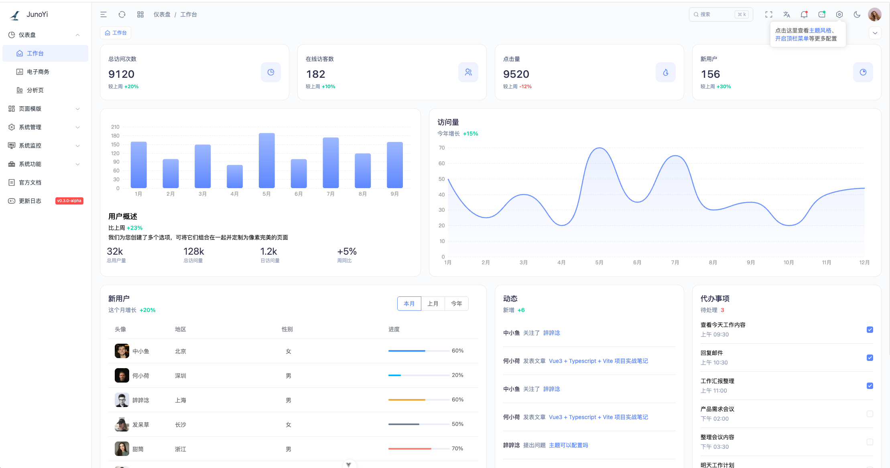
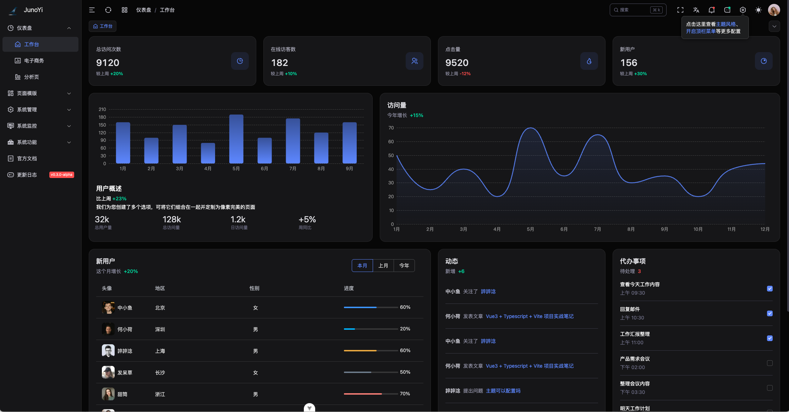

<div align="center">
    
</div>

<div align="center">

[](https://vuejs.org/)
[](https://www.typescriptlang.org/)
[](https://vitejs.dev/)
[](https://element-plus.org/)
[](LICENSE)
[](https://github.com/Juno-Yi/JunoYi-Vue-ElementPlus)

## JunoYi 企业级开发框架 前端

**基于 Vue3 + TypeScript + Element Plus 的现代化企业级后台管理前端**

[特性](#-核心特性) • [快速开始](#-快速开始) • [项目结构](#-项目结构) • [技术栈](#-技术栈) • [贡献](#-贡献指南) • [联系我们](#-联系我们)

📖 [文档站](https://doc.framework.junoyi.com) • 🎮 [演示站](https://demo.junoyi.com)

</div>

---

> **🎉 正式版本发布**
>
> 当前版本为 **0.5.2**，已完成全面测试并正式发布，可用于生产环境。
>
> ✅ **版本特性**
> - 核心功能完整稳定
> - 通过全面测试验证
> - 适合企业级项目开发
> - 可直接用于生产环境
>
> 📌 **相关链接**
> - 📖 文档站：https://doc.framework.junoyi.com 
> - 🎮 演示站：https://demo.junoyi.com
>
> 演示站账号：
>
> 超级管理员 - 账号：super_admin 密码：admin123
>
> 用户管理员 - 账号：admin 密码：admin123
>
> 用户1 - 账号：user1 密码：admin123
---

## 📖 项目介绍

JunoYi 前端是 JunoYi 企业级开发框架的配套前端项目，基于优秀的开源项目 **[Art Design Pro](https://github.com/Daymychen/art-design-pro)** 进行全面升级优化，深度适配 JunoYi 后端框架。

采用 **Vue 3.5** + **TypeScript 5.6** + **Vite 6.0** + **Element Plus** 技术栈，提供现代化、高效率的企业级后台管理界面。

### 🙏 致谢

感谢 [Art Design Pro](https://github.com/Daymychen/art-design-pro) 提供的优秀前端框架基础，本项目在其基础上进行了以下升级优化：

- 🔐 **权限系统重构** - 适配 JunoYi 混合权限模型，支持按钮级权限控制
- 🔒 **安全通信增强** - 集成端到端 API 加密通信能力
- 📡 **接口层重写** - 完整对接 JunoYi 后端 API 规范
- 🏢 **业务模块扩展** - 新增用户、角色、部门、菜单、权限组等系统管理模块
- ⚡ **性能优化** - 路由懒加载、组件按需引入、请求缓存等优化

### ✨ 核心特性

- **现代化界面设计 :** 精心设计的 UI 界面，流畅的交互体验，支持亮色/暗色主题切换
- **TypeScript 全覆盖 :** 完整的类型定义，提供更好的开发体验和代码质量保障
- **丰富的组件库 :** 内置高质量业务组件，涵盖表格、表单、图表等常见场景
- **高效开发工具 :** 封装 useTable、ArtForm 等实用 API，显著提升开发效率
- **灵活的权限控制 :** 支持按钮级权限控制，与后端权限系统无缝对接
- **端到端加密通信 :** 支持 API 请求/响应加密，保障数据传输安全
- **国际化支持 :** 内置多语言支持，轻松实现国际化需求
- **响应式布局 :** 完美适配桌面端和移动端，提供一致的用户体验

---

## 🚀 快速开始

### 环境要求

- Node.js 18+
- pnpm 8+

### 启动步骤

```bash
# 1. 克隆项目
git clone https://github.com/Juno-Yi/JunoYi-Vue-ElementPlus.git

# 2. 进入项目目录
cd JunoYi-Vue-ElementPlus

# 3. 安装依赖
pnpm install

# 如果安装失败，可尝试
pnpm install --ignore-scripts

# 4. 修改配置
# 编辑 .env.development 配置后端 API 地址

# 5. 启动开发服务器
pnpm dev

# 6. 构建生产版本
pnpm build
```

启动成功后访问：http://localhost:3006


## 🛠️ 技术栈

| 类别 | 技术 |
|------|------|
| 开发框架 | Vue 3.5、TypeScript 5.6、Vite 6.0 |
| UI 组件库 | Element Plus 2.9 |
| CSS 框架 | Tailwind CSS 4.0 |
| 状态管理 | Pinia |
| 路由管理 | Vue Router 4 |
| HTTP 请求 | Axios |
| 代码规范 | ESLint、Prettier、Stylelint |
| Git 规范 | Husky、Lint-staged、Commitlint |


完整文档请访问：**https://doc.framework.junoyi.com**

---

## 🏗️ 项目结构

```
JunoYi-Vue-ElementPlus
├── public/                    # 静态资源
├── src/
│   ├── api/                   # API 接口定义
│   ├── assets/                # 静态资源（图片、样式等）
│   ├── components/            # 公共组件
│   │   └── core/              # 核心组件
│   ├── config/                # 项目配置
│   ├── directives/            # 自定义指令
│   ├── hooks/                 # 组合式函数
│   ├── locales/               # 国际化配置
│   ├── plugins/               # 插件配置
│   ├── router/                # 路由配置
│   ├── store/                 # 状态管理
│   ├── types/                 # TypeScript 类型定义
│   ├── utils/                 # 工具函数
│   └── views/                 # 页面视图
│       └── system/            # 系统管理模块
├── .env                       # 环境变量
├── .env.development           # 开发环境变量
├── .env.production            # 生产环境变量
├── vite.config.ts             # Vite 配置
└── tsconfig.json              # TypeScript 配置
```

---

## 📸 界面预览

<kbd></kbd>

<kbd></kbd>

---

## 🤝 贡献指南

欢迎提交 Issue 和 Pull Request！

### 贡献流程

1. Fork 本项目
2. 创建新分支 (`git checkout -b feature/AmazingFeature`)
3. 提交更改 (`git commit -m 'Add some AmazingFeature'`)
4. 推送到分支 (`git push origin feature/AmazingFeature`)
5. 提交 Pull Request

### 代码规范

所有 PR 都需要经过代码审查才能合并。请确保：

- 代码符合项目规范（ESLint、Prettier）
- 通过了所有 CI 检查
- 更新了相关文档

---

## 📞 联系我们

如果你在使用过程中遇到问题，或者有任何建议，欢迎通过以下方式联系我们：

- **QQ 群**：1074033133
- **邮箱**：eatfan0921@163.com

<div align="center">
    
    <p>扫码加入 QQ 群</p>
</div>

---

## ☕ 捐赠赞助

如果这个项目对你有帮助，欢迎请作者喝杯咖啡 ☕

<div align="center">
<table>
<tr>
<td align="center">
    <br/>
    <b>微信</b>
</td>
<td align="center">
    <br/>
    <b>支付宝</b>
</td>
</tr>
</table>
</div>

---

## 📄 许可证

本项目采用 MIT 许可证 - 详见 [LICENSE](LICENSE) 文件

---

## 🔗 相关项目

- [JunoYi 后端框架](https://github.com/Juno-Yi/JunoYi) - JunoYi 企业级后端开发框架
- [Art Design Pro](https://github.com/Daymychen/art-design-pro) - 本项目基于此框架升级优化

---

<div align="center">

**⭐ 如果这个项目对你有帮助，请给个 Star 支持一下！**

Made with ❤️ by JunoYi Team

</div>
